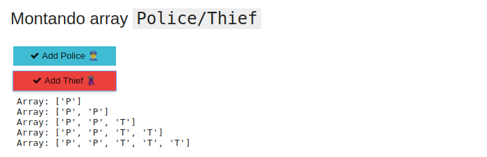
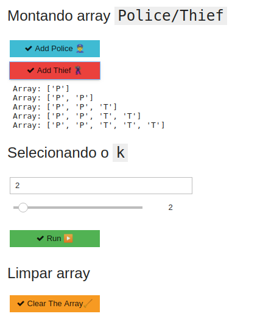

# Polícia e Ladrão

**Número da Lista**: 3<br>
**Conteúdo da Disciplina**: Algoritmos Gulosos<br>

## Alunos
|Matrícula | Aluno |
| -- | -- |
| 17/0138798  |  Caio Fernandes |
| 17/0050939  |  Lucas Dutra |

## Sobre 
### Problema Polícia e Ladrão:

Dado um `array` de tamanho **n** que segue as seguintes especificações:

1. Cada elemento do `array` contém um **policial** ou um **ladrão**.
2. Cada policial pode pegar apenas um ladrão.
3. Um policial só pode pegar um ladrão que esteja até **K** unidades de distância.

O objetivo é encontrar o número máximo de ladrões que possam ser capturados.

Uma abordagem de **força bruta** seria verificar todos os conjuntos de combinações de polícia e ladrão e retornar o tamanho máximo definido entre eles. Porém sua complexidade seria exponencial.

Uma solução eficiente é usar um **Greed Algorithm** (Algoritmo ambicioso).<br>
Podemos tentar: *“Para cada policial da esquerda pegue o ladrão mais próximo possível”*.<br>

Uma outra abordagem seria: 
*“Para cada policial da esquerda pegar o ladrão mais distante possível”*.<br>


Mas pensando independentemente do policial, concentrando apenas nas disposição dos elementos no `array`:
1. Obter o menor índice de policial `p` e ladrão `t`. Fazer uma distribuição
`if | p-t | <= k`  incrementando para o próximo `p` e `t` encontrado.
2. Caso contrário, aumentar `min(p, t)` para o próximo `p` ou `t` encontrado.
3. Repetir as duas etapas acima até que os próximos `p` e `t` sejam encontrados.
4. Retornar o número de distribuições feitas.

A complexidade desta abordagem é **O(n)** onde **n** é o tamanho do `array`.


## Screenshots
### Botões para adicionar mais policiais/ladrões

### Área para definir o valor de K

### Aplicação completa


## Instalação 
**Linguagem**: Python<br>

### Requisitos para executar o projeto
1. [Docker](https://docs.docker.com/get-docker/)
2. [Docker-Compose](https://docs.docker.com/compose/install/)

### Executando o projeto
1. Executar o docker-compose (pode necessitar de permissões de administrador)
    ```
        docker-compose up --build
    ```
2. Acesse, por meio de um navegador o seguinte link
    ```
        http://localhost:8888/
    ```

## Uso 
[Vídeo de explicação](https://github.com/projeto-de-algoritmos/Greed_PoliciaLadrao/blob/master/explicacao.mp4)
1. Após execução do projeto, entre no arquivo `App.ipynb` e clique no botão `Voilà`.
   
2. Adicione Policiais e Ladrões ao array através do botão indicado.
3. Selecione o valor de `K`.
4. Clique no botão `Run` para execução do algoritmo.
5. Caso queira executar novamente o projeto, o botão `Clear the Array` resetará o Array construído e limpará os outputs.


